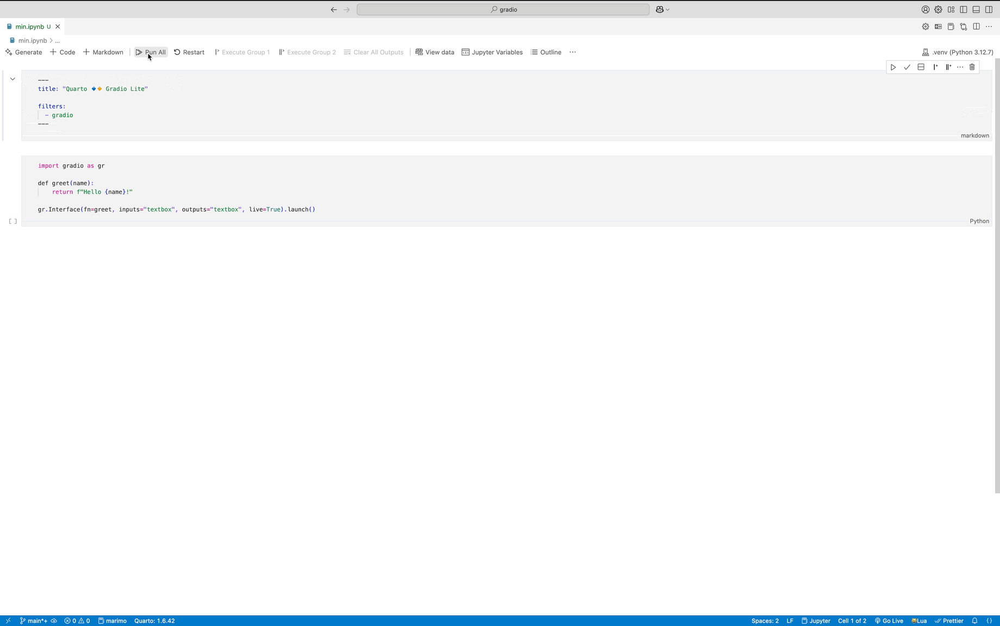

# Gradio Lite Extension for Quarto 

> Enable embedding entirely serverless, browser-based Gradio applications and coding playgrounds in your Quarto documents.

`quarto-gradio` is an extension that embeds [Gradio Lite](https://www.gradio.app/guides/gradio-lite) apps into HTML documents, allowing your Python applications to run directly within your web browser without the need for a server. This extension automatically detects the Python contents of your code blocks as well as the entry points to Gradio apps you define and produces cell output with an embedded [Pyodide-powered](https://pyodide.org/en/stable/) 100% browser-based application. It works with all HTML-based formats including Reveal.js.

## Installing

```bash
quarto add peter-gy/quarto-gradio
```

This will install the extension under the `_extensions` subdirectory.
If you're using version control, you will want to check in this directory.

## Using

This extension is implemented as a Quarto filter. Once registered, it works out of the box with Python code blocks and can be customized further via top-level metadata in the document's frontmatter as well as via cell options specified within comments at the top of code blocks.

This extension was designed to work both with documents written in **Q**uarto **M**ark**d**own and Jupyter Notebooks; therefore, it is possible to iterate on your Gradio app's code in a convenient, traditional server-based Jupyter environment and distribute your notebook as a static, completely serverless web bundle.

> [!TIP]
> The extension allows advanced configuration via cell options. For example, specifying `#| gr-playground: true` transforms the Gradio Lite interface into an interactive coding playground.



### Playground Mode

````md
---
title: "Quarto 🔹🔸 Gradio Lite"

filters:
  - gradio
---

```{python}
#| gr-theme: light
#| gr-playground: true
#| gr-layout: vertical
import gradio as gr

def greet(name):
    return f"Hello {name}!"

gr.Interface(fn=greet, inputs="textbox", outputs="textbox", live=True).launch()
```
````

### Application Mode

````md
---
title: "Quarto 🔹🔸 Gradio Lite"

filters:
  - gradio
---

```{python}
#| gr-theme: light
import gradio as gr

def greet(name):
    return f"Hello {name}!"

gr.Interface(fn=greet, inputs="textbox", outputs="textbox", live=True).launch()
```
````

## Example

Here is the source code of a minimal example: [example.qmd](example.qmd).

For more detailed guide, further examples and rendered output, please refer to the [documentation site](https://quarto-gradio.peter.gy).
