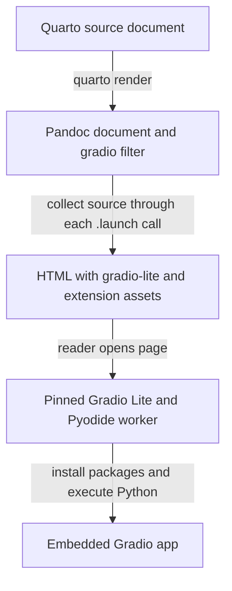

# Architecture

`quarto-gradio` connects Quarto's document build pipeline to Gradio Lite's browser runtime. The extension collects Python source during `quarto render`, writes that source into the output HTML, and lets the reader's browser execute it later.

This page is the contributor entry point. It defines the product model, source ownership, lifecycle, and implementation boundaries.

## Product model



The render-time and browser-time stages are independent. Quarto does not run the app when document execution is disabled. The browser does not invoke the Lua filter when a reader opens the page.

## Components

### Extension manifest

`_extensions/gradio/_extension.yml` registers the extension and its `gradio.lua` contributor filter. Quarto discovers this file under a project's `_extensions` directory.

### Pandoc filter

`_extensions/gradio/gradio.lua` owns the document transformation. Quarto converts source documents to a Pandoc document before this filter runs.

The filter recognizes a Python code block when the Pandoc node has both `cell-code` and `python` classes. It appends every recognized cell's source to one accumulator. When a cell contains the literal pattern `.launch(`, its parent cell `Div` becomes a launch boundary.

At each launch boundary, the filter:

1. Reads the launch cell's `gr-*` cell options.
2. Merges them over document-wide Gradio Lite attributes.
3. Generates one Gradio Lite HTML fragment from the accumulated source.
4. Places the original launch cell and generated fragment in the document.
5. Clears the accumulator for the next app.

Imports, helper functions, and component declarations can therefore span several Python code cells. Their order is preserved. Two launch cells emit two embedded apps. Several `.launch()` calls inside one cell still produce one app because the cell is the boundary.

The launch detection is a source-text convention. An indirect call that never contains `.launch(` does not close a source segment. A comment or string containing `.launch(` can close one even when no app is launched at runtime.

### Configuration parser

`_extensions/gradio/gradio-meta.lua` owns four configuration groups:

- `gradio.cdn` selects the runtime asset base URL.
- `gradio.version` selects the Gradio Lite runtime version appended to that URL.
- `gradio.requirements` lists document-wide app requirements.
- `gradio.attributes` contains document-wide attributes forwarded to `<gradio-lite>`.

Cell options beginning with `gr-` become attributes for the app closed by that cell. The prefix is removed. Cell options win over document-wide attributes because they are merged last.

### HTML generator

`_extensions/gradio/gradio-html.lua` serializes the runtime scripts, styles, requirements, attributes, and accumulated Python source. It emits one wrapper with this shape:

```html
<div class="quarto-gradio">
  <script type="module" src=".../dist/lite.js"></script>
  <link rel="stylesheet" href=".../dist/lite.css">
  <gradio-lite theme="dark">
    <gradio-requirements>...</gradio-requirements>
    ...escaped Python source...
  </gradio-lite>
</div>
```

True boolean attributes are serialized as bare HTML attributes. False boolean attributes are omitted. Other values are quoted. Python source is HTML-escaped before insertion.

The generator currently accepts one accumulated source entry. The internal `app.py` name is not emitted and no `<gradio-file>` element is created.

### Quarto HTML dependency

When the first launch cell is found, `gradio-html.lua` registers the extension-owned browser assets:

- `assets/js/gradio-compat.js`
- `assets/css/quarto-gradio.css`
- `assets/python/runtime-requirements.txt`

Quarto copies these files into a format-specific dependency directory containing `quarto-contrib/quarto-gradio-*`. Website builds use `site_libs`, while standalone document tests use `<output>_files/libs`. The HTML dependency version controls the final cache path.

Documents with no launch cell do not register or load these assets.

### Browser runtime

The generated page loads `@gradio/lite` from the configured runtime asset base URL. Gradio Lite starts Pyodide in a dedicated web worker by default, installs app requirements, executes the accumulated Python source, and mounts the Gradio interface.

`gradio-compat.js` modifies startup for the default frozen runtime. It loads the pinned worker source and runtime compatibility pins, patches the worker's installation sequence, then starts the worker and replays buffered events. See [runtime-compatibility.md](runtime-compatibility.md).

### CSS bridge

`assets/css/quarto-gradio.css` fixes a narrow set of integration conflicts:

- It protects Gradio's `.column` component from Bootstrap column sizing.
- It gives the loading surface a visible border.
- It hides the Gradio footer inside an embedded document.
- It aligns the app surface with the document background.
- It supplies system monospace fonts that are unavailable in the archived package assets.

Visual behavior belongs to browser validation. Do not pin these CSS literals in unit tests.

### Debug fragment

When `QUARTO_GRADIO_DEBUG` is set, `gradio-debug.lua` writes the generated app HTML fragment to `<input-base>.debug.html` in the render process working directory. This is a fragment for inspecting generated markup, not a complete standalone page. Each app uses the same path, so the last app in a multi-app document replaces the earlier fragment.

## Supported delivery shapes

The source-grounded support matrix is:

| Source format | Output format | Evidence |
|---|---|---|
| Quarto Markdown (`.qmd`) | HTML page | Render tests and documentation site |
| Quarto Markdown (`.qmd`) | Reveal.js presentation | Documentation example and browser validation |
| Jupyter notebook (`.ipynb`) | HTML page | Tracked site render target and browser validation |

Other Pandoc-backed inputs may produce compatible nodes, but they are not part of the documented contract until they have a fixture and browser evidence.

## Failure ownership

| Symptom | Owning stage | First evidence |
|---|---|---|
| Quarto cannot find `gradio` | Extension discovery | Render command output |
| No embedded app markup | Filter matching or launch boundary | Rendered HTML and debug logs |
| Wrong runtime URL or attributes | Metadata parsing or HTML generation | Rendered HTML |
| App remains at startup or reports a Python error | Browser runtime, network, or app source | Browser console and network panel |
| Package cannot install | Pyodide or package compatibility | Gradio Lite error output and browser console |
| Layout or theme conflict | CSS bridge or page theme | Browser inspection at the affected viewport |

## Design constraints

- Keep the public surface inside Quarto metadata and cell options. Do not add another configuration layer for internal convenience.
- Preserve document order. Source accumulation and reset behavior define multi-app composition.
- Keep browser compatibility logic scoped to the exact runtime it understands.
- Keep extension assets inside the Quarto HTML dependency so copied installations remain self-contained apart from remote runtime and package requests.
- Keep public docs focused on authoring and operation. Keep AST, bootstrap, cache, and release ownership in `development_docs/`.

## Related documentation

- [Configuration and rendering](configuration-and-rendering.md)
- [Runtime compatibility](runtime-compatibility.md)
- [Testing](testing.md)
- [Examples](examples.md)
- [Documentation](documentation.md)
- [Releasing](releasing.md)
