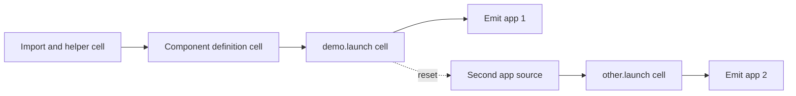

# Configuration and rendering

The `gradio` filter accepts document-wide metadata and per-app cell options. This page records parsing, precedence, serialization, and app-boundary behavior for maintainers.

## Document-wide configuration

The document's YAML front matter can contain:

```yaml
gradio:
  cdn: "https://cdn.jsdelivr.net/npm/@gradio/lite"
  version: "5.45.0"
  requirements:
    - "plotly==5.24.1"
  attributes:
    theme: light
    shared-worker: false
```

Defaults live in `_extensions/gradio/gradio-meta.lua`.

| Key | Parsed value | Default | Scope |
|---|---|---|---|
| `gradio.cdn` | Scalar string | jsDelivr `@gradio/lite` asset root | Document |
| `gradio.version` | Scalar string | `5.45.0` | Document |
| `gradio.requirements` | List of strings | Empty list | Every app in the document |
| `gradio.attributes` | Mapping of literals | `theme: dark`, `shared-worker: false` | Every app unless overridden |

Setting `gradio.cdn` clears the default runtime version. This lets a custom value point directly at a versioned asset root. When both `gradio.cdn` and `gradio.version` are authored, the generator builds `cdn + "@" + version`.

## Cell options

A launch cell can override Gradio Lite attributes for its app:

```python
#| gr-theme: light
#| gr-playground: true
#| gr-layout: vertical
```

`parse_attributes` selects keys with the `gr-` prefix and removes that prefix. These values are merged after document-wide attributes.

Cell options do not override `gradio.cdn`, `gradio.version`, or `gradio.requirements`. Those settings remain document-wide.

## Source accumulation

The Pandoc walk invokes `CodeBlock` before the parent `Div`. Each matching Python block is appended to the current source accumulator, including the launch cell itself. The parent `Div` then emits the app and resets the accumulator.



Python cells after the final `.launch()` remain accumulated but produce no app. Non-Python cells do not enter the accumulator.

## Attribute serialization

`build_attributes_string` implements HTML boolean conventions:

| Authored value | Output |
|---|---|
| `true` or `"true"` | Bare attribute, such as `playground` |
| `false` or `"false"` | Attribute omitted |
| Other value | Quoted attribute, such as `theme="light"` |

Metadata keys are forwarded rather than checked against an allowlist. Public docs describe the tested attributes and identify the remaining surface as archived-runtime passthrough. New documented attributes need render and browser evidence.

## HTML dependency and cache path

`ensure_html_deps` registers one Quarto HTML dependency named `quarto-gradio`. Quarto copies the JavaScript, CSS, and compatibility requirement file into a versioned site library directory. If any extension-owned browser asset changes, update the dependency version with the extension release version so published pages receive the new file.

## Debug output

Set `QUARTO_GRADIO_DEBUG=1` while rendering to write `<input-base>.debug.html` in the render process working directory. Inspect this fragment when metadata appears correct in the source but the emitted URL, requirements, attributes, or Python source is wrong.

The debug writer uses one filename per source document. In a multi-app document, the final app fragment is the retained output.
