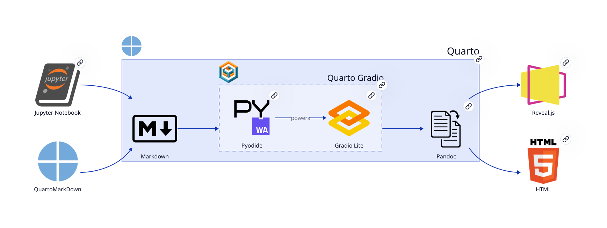

## Supported YAML Metadata

The `quarto-gradio` extension processes the following YAML metadata:

```yml
gradio:
    # @gradio/lite CDN base
    cdn: "https://cdn.jsdelivr.net/npm/\\@gradio/lite"
    
    # @gradio/lite version, defaults to the final release
    version: "5.45.0"
    
    # Deps to pass to <gradio-requirements/>
    requirements:                                    
        - plotly==5.24.0
    
    # List of attributes to pass to <gradio-lite/> tag
    attributes:              
        # Optional: "dark" or "light", defaults to "dark"
        theme: dark          
        
        # Optional: true or false, defaults to false
        shared-worker: false
        
        # Optional: true or false
        playground: false    
        
        # Optional: "horizontal" or "vertical"
        layout: horizontal   
```

The extension passes this metadata to the HTML tags defined by the [archived `@gradio/lite` package](https://github.com/gradio-app/gradio-lite){target=_blank}. The default CDN and version resolve to `https://cdn.jsdelivr.net/npm/@gradio/lite@5.45.0`. Keep these defaults together to use the bundled Pyodide compatibility requirements. Set `version` or `cdn` when you control the corresponding archived runtime and dependency set. See the [Gradio Lite 4.44.1 guide](https://gradio.app/4.44.1/guides/gradio-lite){target=_blank} for the element and attribute contracts.

## Supported Python Requirement Formats

You can consult the [📦 Customize Python Modules](../guide/customize-python-modules/) guide for an example of how to use the `requirements` metadata.

| Format             | Description                                      | Example                                             |
|------------------- |--------------------------------------------------|-----------------------------------------------------|
| Package name       | Just the package name to install latest version  | `plotly`                                            |
| Package and version| Package with specific version or version range   | `plotly==5.24.0`                                    |
| URL                | Remote wheel or source distribution              | https://some.cdn.com/plotly-5.24.1-py3-none-any.whl |

For a deep-dive into the details of Python packages in a browser environment, see the [Pyodide documentation](https://pyodide.org/en/stable/usage/packages-in-pyodide.html){target=_blank}.

## Document Processing Flow

The main idea behind this extension is to hook into the lifecycle of the Quarto document at the stage where it is represented as a [Pandoc Abstract Syntax Tree (AST)](https://pandoc.org/filters.html){target=_blank}, collect all the source code from Python code blocks and dynamically construct the appropriate HTML tree by populating the `<gradio-requirements/>` and `<gradio-lite/>` tags.


